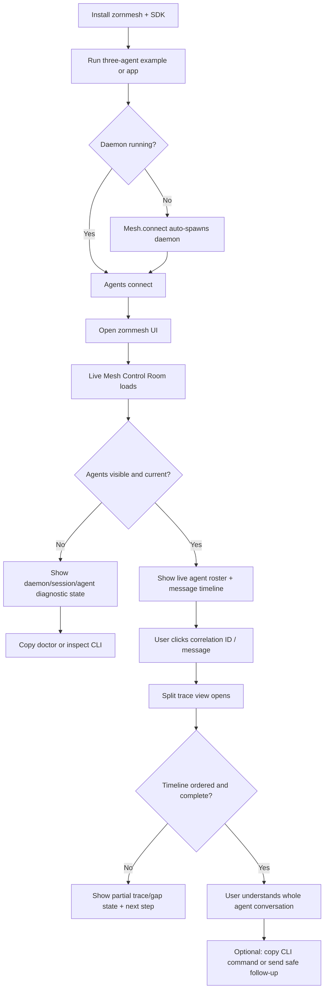
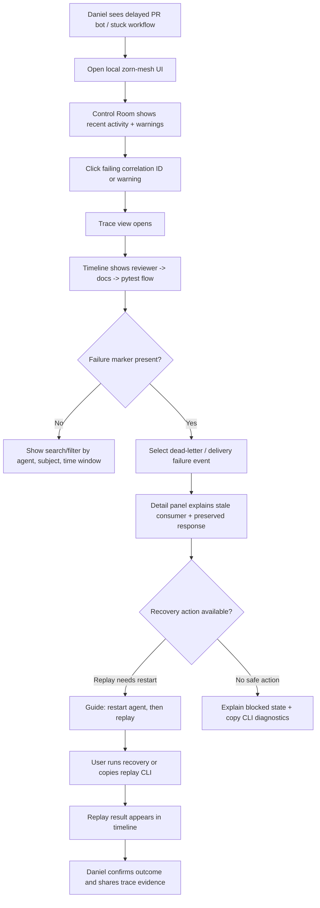
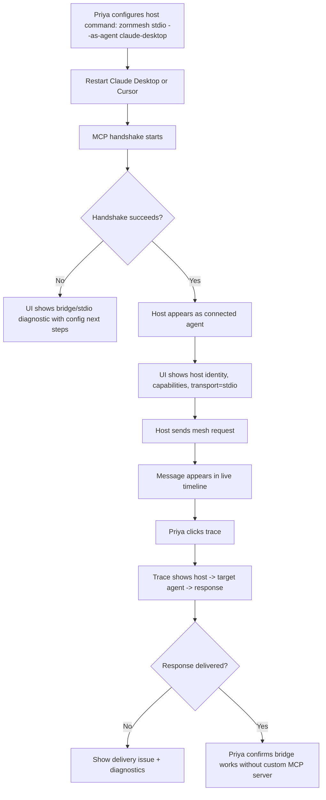
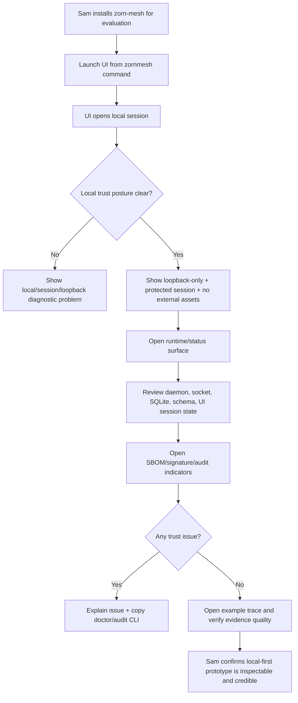
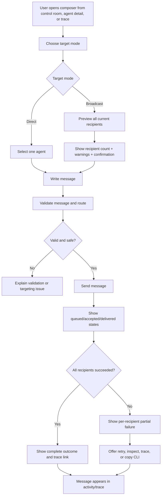

# UX Design Specification zorn-mesh

**Author:** Nebrass
**Date:** 2026-04-27

---

<!-- UX design content will be appended sequentially through collaborative workflow steps -->

## Executive Summary

### Project Vision

zorn-mesh is a local-first agent coordination fabric for developers who run multiple AI coding agents and need those agents to communicate, fail transparently, and leave an inspectable trail. The product promise remains: connected agents should be visible, messages should be traceable, and the user should be able to understand and influence the mesh without operating a separate broker.

The v0.1 UX now includes a **local web companion control plane** as a first-class product surface alongside the `zornmesh` CLI, SDK connection path, daemon lifecycle, MCP-stdio bridge, and forensic/audit commands. The web UI should let users see connected agents, inspect message and conversation flow, diagnose current mesh state, and send a message either to a specific coding agent or to all connected agents. The CLI remains the durable automation and recovery surface; the web UI makes the mesh visible and controllable for interactive human use.

This was a deliberate scope correction relative to earlier planning artifacts. The current PRD now includes the v0.1 local web UI; the architecture has been amended so implementation covers the local web UI surface, daemon/API boundary, packaging model, loopback/session protection, safe message-sending semantics, accessibility obligations, test fixtures, and release acceptance criteria.

### Target Users

- **Maya, the primary developer/user:** a senior product engineer working with multiple coding agents. She needs a quick way to see which agents are connected, understand what they are doing, inspect recent messages, and send targeted or broadcast instructions without stitching together terminal commands.
- **Daniel, the forensic recovery user:** an on-call developer debugging a broken multi-agent workflow under pressure. He still needs trustworthy timelines, dead-letter visibility, replay, agent liveness, and actionable error states; the web UI should make current mesh state and recent failures easier to scan before dropping into CLI commands for scripted recovery.
- **Priya, the MCP-host integration user:** an applied researcher or power user who wants Claude Desktop, Cursor, or another MCP host to join the bus through `zornmesh stdio --as-agent <id>`, then confirm from the UI that the host is connected and messages are flowing.
- **Sam, the platform/security evaluator:** a later-stage evaluator who needs confidence that local-first prototypes have credible diagnostics, SBOM/signature posture, audit verification, compliance evidence, and a clearly bounded local web UI that does not accidentally become a network-exposed broker console.

### Key Design Challenges

- **Reconciling web UI scope with architecture:** the current PRD and architecture now include the v0.1 local web UI. This UX spec treats the web UI as in scope and constrains implementation to the local, protected, observe/inspect/safe-intervention-only surface.
- **Defining a narrow v0.1 UI slice:** the web UI should be a local dashboard and companion control plane for agents, messages, diagnostics, and direct/broadcast sends. It should not become cloud accounts, teams, rich chat, plugins, advanced search, or a workflow editor in v0.1.
- **Representing distributed-agent behavior visually:** the UI must turn agents, capabilities, subjects, messages, timings, ACK states, leases, dead letters, replay history, and trace context into views that are easy to scan without implying stronger guarantees than the daemon provides.
- **Making agent state legible:** the UI needs clear status language for connected, idle, busy, stale, errored, disconnected, reconnecting, and unknown states, with last activity and diagnostic next steps where possible.
- **Designing safe message-sending controls:** sending to one coding agent or all agents is powerful and potentially disruptive. The UX must distinguish direct versus broadcast sends, preview routing scope, require confirmation where appropriate, and surface per-agent delivery, ACK, rejection, queued, failed, or cancelled outcomes.
- **Serving both interactive UI users and automation users:** the web UI can be the human overview/control surface, while the CLI must retain stable JSON/NDJSON, stderr separation, `NO_COLOR`, non-interactive mode, and stable exit codes for scripts, CI, and incident runbooks.
- **Maintaining local-first security expectations:** if a web UI ships in v0.1, it must preserve the project's local-first trust model: no default public network exposure, loopback-only access, token/session and CSRF protection, safe handling of secrets, and explicit diagnostics when the UI/API boundary is unavailable.
- **Keeping first-run friction low:** users should be able to install, connect agents, open the UI, see live agents/messages, send a test message, and inspect a trace without needing to understand daemon internals first.

### Design Opportunities

- **Make the agent graph visible:** a live connected-agent view can make the mesh feel tangible, showing agent identities, capabilities, liveness, subscriptions, recent activity, and warning states at a glance.
- **Make message flow inspectable:** a message/conversation view can complement `zornmesh trace <correlation_id>` by letting users browse recent traffic, filter by agent, subject, and correlation ID, and drill into payload metadata safely.
- **Make trace exploration visual:** timeline views, correlation IDs, causality links, dead-letter markers, and recovery actions can turn the forensic CLI hero workflow into an approachable interactive experience.
- **Create a safe control plane for human-directed agent work:** targeted and broadcast message actions can turn zorn-mesh from passive observability into an interactive coordination workspace, as long as delivery scope, permissions, and outcomes are explicit.
- **Bridge UI and CLI instead of making them compete:** the UI can offer copyable CLI commands for trace, inspect, replay, doctor, and audit verification so users can move from exploration to automation or incident runbooks.
- **Use progressive disclosure across UI and CLI:** the web UI can handle overview, exploration, and guided sends; the CLI can remain the precise tool for automation, fixtures, recovery, and offline audit checks.
- **Turn local-first constraints into trust signals:** loopback-only access, session/token protection, socket status, daemon health, audit integrity, and SBOM/signature state can be visible as reassuring status cues rather than hidden internals.

## Core User Experience

### Defining Experience

The core v0.1 experience is an **observe → inspect chronology → send safely → confirm outcome** loop in a local web companion control plane. A user opens the zorn-mesh UI in their browser, immediately sees the live mesh of connected coding agents, inspects a correctly ordered message or trace timeline to understand what happened, then sends a direct or broadcast message only after recipient scope is clear and delivery outcomes can be confirmed.

The experience should feel less like configuring infrastructure and more like opening a live control room for local agents. The UI's first job is to make the mesh visible: who is connected, what each agent can do, whether each agent is healthy, what messages are flowing, and which conversations need attention. Its second job is comprehension: users should be able to click from an agent, message, subject, or correlation ID into a trace and understand who said what, when, why, and what triggered it. Its third job is safe intervention: users should be able to message one agent or all agents only when routing scope, recipient count, and expected outcomes are explicit.

The primary v0.1 screen should combine a live agent roster, a shared message/trace timeline, and a safe message composer. Actions are secondary to understanding: the UI should first establish trustworthy mesh state, then enable directed intervention.

### Platform Strategy

The v0.1 platform is a **local web app opened in the user's browser from zorn-mesh**, backed by the local daemon. It is not a hosted cloud app, not a LAN-accessible console by default, and not a desktop shell in v0.1. All UI assets must be bundled locally after installation; the core UI must work without internet access, external CDNs, or external services.

The canonical launch path should be defined by the updated architecture, likely as a dedicated `zornmesh ui` or `zornmesh open` command that starts or connects to the local daemon, binds only to loopback, creates a protected local session, and opens the browser. The UI should make local-only status visible so users understand that the console is scoped to their machine.

The UI should preserve the project's local-first security posture. Access should be loopback-only by default, protected by per-session token and CSRF safeguards, and explicit about daemon/API availability. Live updates should come from a daemon-backed real-time channel such as WebSocket or SSE with reconnect and event backfill; reloads and daemon restarts should restore state from the daemon log rather than losing the user's place.

### Effortless Interactions

The most effortless interaction should be **seeing agents appear and update live with no setup**. When agents connect, disconnect, become stale, emit messages, or change activity state, the UI should reflect that without refresh or manual polling from the user's perspective.

Other interactions should feel direct and low-friction:

- Opening the UI reveals the current mesh immediately.
- Connected agents show stable ID, display name, role/capability summary, transport, status, last-seen timestamp, last activity, subscriptions, and warnings.
- Agent status language distinguishes connected, idle, busy, stale, errored, disconnected, reconnecting, and unknown states.
- Clicking an agent reveals its recent messages and relevant traces.
- Clicking a message, subject, or correlation ID opens the full trace context.
- The trace detail view shows causal links: parent message, response, tool/action, sender, recipient or recipients, timestamp, daemon sequence, delivery state, and any dead-letter or replay markers.
- Direct and broadcast send actions preview recipient scope before sending.
- Broadcast sends show recipient count and require an explicit confirmation pattern when targeting all connected agents.
- Delivery states are visible per recipient where applicable: pending, queued, accepted, delivered, acknowledged, rejected, failed, cancelled, or replayed.
- UI views offer copyable CLI commands for precise recovery, automation, or runbook use.

### Critical Success Moments

The primary first-time success moment is: **the user inspects a trace and understands the whole agent conversation**. Live agents appearing in the UI creates confidence that the mesh is real, but trace comprehension creates the durable “this is better” moment.

Make-or-break flows include:

- Opening the local UI and seeing connected agents update live.
- Selecting an agent and understanding its identity, health, capabilities, and recent activity.
- Inspecting a message or correlation ID and seeing a correctly ordered conversation timeline.
- Understanding chronology, causality, timestamps, daemon sequence, delivery states, gaps, late arrivals, retries, dead-letter markers, and recovery options without guessing.
- Sending a direct message to one agent with clear delivery outcome.
- Sending a broadcast message with explicit recipient preview and per-agent results, including partial failure.
- Refreshing the browser or reconnecting after daemon restart without losing persisted trace context.
- Moving from UI exploration to CLI recovery through copyable `trace`, `inspect`, `replay`, `doctor`, or `audit verify` commands.

The most trust-damaging failure would be confusing or incorrect message/trace ordering. Chronology and causality must therefore be treated as core UX correctness requirements, not visual polish. The UI must order traces by daemon-assigned monotonic sequence plus timestamp context, never by browser receipt time alone.

### Experience Principles

1. **Live mesh first:** open to a current, self-updating view of connected agents, status, capabilities, and recent activity.
2. **Trace comprehension is the aha:** the defining success moment is understanding a whole agent interaction from a trace or conversation view.
3. **Chronology must be trustworthy:** ordering, causality, timestamps, daemon sequence, delivery states, late arrivals, replays, and gaps must be visually unambiguous.
4. **Safe action follows understanding:** direct and broadcast sends must preview routing scope, prevent targeting mistakes, and report clear per-agent outcomes.
5. **Local means local:** the web UI is browser-based, locally opened, locally bundled, offline-capable, loopback-only by default, session-protected, and free of external runtime dependencies.
6. **State survives ordinary disruption:** browser refresh, reconnect, event backfill, and daemon restart should restore persisted mesh and trace context rather than making the UI feel ephemeral.
7. **UI and CLI reinforce each other:** the UI supports exploration and guided intervention; the CLI remains the stable automation, recovery, and offline audit surface.

### Step 3 Acceptance Notes for Downstream PRD/Architecture Updates

- Define the canonical UI launch command and packaging model.
- Define the daemon API and live-update transport for the local UI.
- Define agent identity fields and status taxonomy.
- Define trace ordering around daemon-assigned sequence, timestamp context, causal parent, broadcast fan-out, and delivery state.
- Define safe direct/broadcast send semantics, including offline recipients, partial broadcast failure, duplicate-send prevention, retries, and per-recipient outcomes.
- Add fixtures for interleaved multi-agent traces, broadcast mixed success/failure, reconnect with preserved ordering, clock skew, daemon restart with persisted trace integrity, and browser E2E for observe → inspect trace → send direct → send broadcast.

## Desired Emotional Response

### Primary Emotional Goals

The primary emotional goal is **calm confidence**: users should feel that they can understand what happened in their agent mesh even when agents fail, messages stall, delivery is partial, or traces reveal unexpected behavior. The web UI should reduce uncertainty rather than merely expose more data.

The UI should make users feel that the mesh is organized, trustworthy, and manageable. When they open the UI, they should not feel like they are looking at a raw protocol debugger; they should feel like they are entering a clear local control room where live state, message flow, and safe actions are understandable.

### Emotional Journey Mapping

- **First discovery / first open:** users should feel **confidence**. The connected-agent view should communicate that zorn-mesh is organized, current, local, and trustworthy.
- **Core observe state:** users should feel **oriented**. They can see which agents exist, which are active, which are stale or unhealthy, and what recent activity is relevant.
- **Trace inspection:** users should feel **clarity**. They can follow who did what, when it happened, why it happened, what triggered it, and where delivery or causality changed.
- **Message sending:** users should feel **protected and in control**. Direct and broadcast actions should make recipient scope, confirmation, delivery status, and failure outcomes explicit.
- **Failure states:** users should feel **protected**, not blamed or abandoned. The UI should prevent unsafe or confusing actions and explain the next safe step.
- **After task completion:** users should feel **capable**. They should leave believing they can manage the agent mesh themselves, not that they survived a complex debugging tool by luck.
- **Return visits:** users should feel **trust through continuity**. State should restore after refresh/reconnect, chronology should remain consistent, and the UI should not make users re-learn the mesh each time.

### Micro-Emotions

Critical positive micro-emotions:

- **Confidence over doubt:** live state appears current, consistent, and explainable.
- **Clarity over ambiguity:** trace views reveal causality and ordering without making users infer from raw logs.
- **Protection over anxiety:** unsafe sends, broad broadcasts, stale data, and partial failures are guarded by clear UX patterns.
- **Capability over dependence:** the UI teaches users how to reason about the mesh and bridges to CLI commands when they need precision.
- **Relief over log fatigue:** users should not feel forced to stitch together terminals, timestamps, and agent logs manually.

Critical negative emotions to avoid:

- **Distrust from stale or inconsistent data.** This is the highest-risk negative emotion. If agent status, message ordering, delivery state, or trace chronology appears inconsistent, users will stop believing the UI.
- **Confusion from unclear ordering or status.** Timeline order, causal links, retry markers, replay markers, and dead-letter states must be visually distinct.
- **Anxiety from unsafe action controls.** Broadcast and direct sends must never feel accidental or ambiguous.
- **Overwhelm from protocol detail.** Technical depth should be available through progressive disclosure, not forced into the primary view.

### Design Implications

- **Calm confidence → stable layout and current-state cues:** the main screen should avoid noisy dashboards and instead emphasize live agent status, timeline consistency, and clear health indicators.
- **Confidence → local trust signals:** show loopback/local-only status, daemon health, session protection, and offline/bundled posture in lightweight ways that reassure without distracting.
- **Clarity → trace-first visual hierarchy:** traces should show sender, recipient, causal parent, timestamp, daemon sequence, delivery state, and outcome in a visually ordered structure.
- **Protection → guarded actions:** direct and broadcast sends should preview recipient scope, show recipient count, distinguish one-agent from all-agent targeting, and report per-recipient outcomes.
- **Capability → explainable next steps:** error, empty, stale, missing-trace, partial-failure, and daemon-unavailable states should include the next safe action and, where useful, a copyable CLI command.
- **Trust continuity → reload/reconnect resilience:** browser refresh, reconnect, and daemon restart should restore persisted trace context and avoid making users question whether the UI lost evidence.
- **Relief → reduce cross-tool stitching:** the UI should pull together agent status, message flow, trace detail, and relevant recovery actions so users do not need to mentally correlate multiple logs.

### Emotional Design Principles

1. **Make the mesh feel knowable:** every primary view should reduce uncertainty about agents, messages, state, or next action.
2. **Never make users doubt chronology:** ordering, causality, gaps, retries, replays, and delivery states must be explicit and consistent.
3. **Protect before empowering:** message-sending controls should prevent accidental broad impact before optimizing for speed.
4. **Show enough, then disclose depth:** keep the primary UI calm while letting advanced users drill into protocol detail, payload metadata, and CLI commands.
5. **Reassure through locality:** local-only access, daemon status, session protection, and offline assets should be visible trust cues.
6. **Turn failures into guided recovery:** every error or degraded state should preserve user confidence by explaining what happened and what can be done next.
7. **Leave users feeling capable:** the UI should teach the mesh's behavior through clear state and trace interactions, not hide complexity behind magic.

## UX Pattern Analysis & Inspiration

### Inspiring Products Analysis

#### Sentry

Sentry is the strongest inspiration for forensic clarity. It takes messy runtime behavior and turns it into a triageable object: an issue, event, stack trace, context bundle, timeline, and set of next actions. For zorn-mesh, the transferable idea is not error monitoring itself; it is the discipline of making “what happened?” answerable from one coherent view.

Relevant Sentry strengths for zorn-mesh:

- Context-rich event detail that connects symptom, cause, metadata, and timeline.
- Triage flow that helps users move from “something happened” to “I understand what happened.”
- Grouping and drill-down patterns that prevent raw event streams from becoming noise.
- Clear distinction between summary, evidence, and technical detail.
- Error-state UX that encourages investigation rather than panic.

For zorn-mesh, Sentry-like patterns should inform trace detail, dead-letter inspection, message failure explanation, retry/replay context, and causal links between agent actions.

#### Linear

Linear is the strongest inspiration for interaction feel: fast, calm, focused, and low-friction. It makes complex team/workflow state feel manageable through restrained visual design, strong keyboard/mouse ergonomics, predictable navigation, and minimal latency.

Relevant Linear strengths for zorn-mesh:

- Calm visual hierarchy that keeps dense information from feeling heavy.
- Fast transitions and low-latency interactions that make the product feel precise.
- Focused surfaces where each view has a clear job.
- Minimal chrome and reduced visual noise.
- Interaction polish that builds trust through consistency.

For zorn-mesh, Linear-like patterns should inform the live mesh overview, trace navigation, command/action affordances, filtering, keyboard-friendly movement between agents/messages/traces, and an interface tone that feels calm rather than alarmist.

#### Docker Desktop

Docker Desktop is the strongest inspiration for local system visibility. It gives users a GUI over local runtime state: running containers, images, volumes, logs, resource usage, daemon health, and troubleshooting cues. It is especially relevant because zorn-mesh also depends on local daemon state that users should understand without becoming daemon experts.

Relevant Docker Desktop strengths for zorn-mesh:

- Clear local runtime status and resource visibility.
- Accessible inspection of running units and their logs/activity.
- Troubleshooting affordances when local infrastructure is unavailable or unhealthy.
- A bridge between CLI mental models and GUI workflows.
- Local-first framing that makes background infrastructure visible and manageable.

For zorn-mesh, Docker Desktop-like patterns should inform daemon status, connected-agent roster, local-only trust cues, socket/session health, offline/bundled UI expectations, and recovery states when the daemon or local API is unavailable.

### Transferable UX Patterns

#### Navigation Patterns

- **Overview → detail drill-down:** start with live agents and message activity, then let users drill into agent detail, message detail, trace detail, dead-letter state, or delivery outcome.
- **Triage-first information architecture:** present the most decision-relevant information first, with deeper protocol details available through progressive disclosure.
- **Persistent local status rail/header:** keep daemon health, local-only status, session protection, and current connection state visible without overwhelming the main content.
- **Cross-linking between objects:** agents, messages, subjects, correlation IDs, traces, delivery attempts, and CLI commands should link to one another so users can follow causality.

#### Interaction Patterns

- **Click-to-understand traces:** clicking a message or correlation ID should open a coherent trace view rather than dumping raw log rows.
- **Fast focused transitions:** moving between agents, messages, traces, and send results should feel immediate and predictable.
- **Safe action preview:** direct and broadcast sends should preview recipient scope and expected routing before submission.
- **Guided recovery:** failure states should offer a next action, such as inspect dead letters, replay, run doctor, verify audit, or copy a CLI command.
- **Keyboard-friendly power use:** advanced users should be able to navigate agents/messages/traces efficiently without turning the UI into a terminal clone.

#### Visual Patterns

- **Calm density:** show rich state without dashboard noise; prioritize ordering, state, and causality over decorative metrics.
- **Status clarity:** agent state, daemon state, delivery state, retry/replay state, and dead-letter state should use distinct, consistent visual treatments.
- **Trace as structured evidence:** the timeline should feel like a trustworthy reconstruction, not a scrolling log.
- **Local trust cues:** loopback-only, session-protected, offline/bundled, and daemon-connected states should be visible as subtle reassurance.

### Anti-Patterns to Avoid

- **Opaque local daemon state:** users should never feel that the web UI is a thin layer over hidden infrastructure they cannot reason about. If the daemon is starting, unreachable, degraded, reconnecting, or stale, the UI must say so clearly.
- **Flaky-feeling live state:** stale agent status, delayed updates, unexplained reconnects, or inconsistent timelines will create distrust faster than missing features.
- **Raw observability overload:** zorn-mesh should not become a dense metrics dashboard full of charts before users can answer who did what and why.
- **Pretty minimalism that hides evidence:** Linear-like calm should not remove the causal detail users need to debug agent behavior.
- **Unsafe chat-like broadcast:** message sending should not feel like casual chat when it can affect multiple coding agents; recipient scope and outcome must be explicit.
- **CLI/UI divergence:** the UI should not invent state or semantics that differ from CLI outputs, daemon logs, or persisted traces.

### Design Inspiration Strategy

**What to adopt:**

- Sentry's context-rich triage model for trace detail, failure explanation, and causal evidence.
- Linear's speed, calm visual hierarchy, and polished interaction feel for daily use.
- Docker Desktop's local runtime visibility for daemon health, agent state, local trust cues, and troubleshooting.

**What to adapt:**

- Adapt Sentry's issue/event model into a message/trace model centered on correlation IDs, agent identities, delivery states, and causal links.
- Adapt Linear's minimalism with progressive disclosure so the UI feels calm without hiding protocol evidence.
- Adapt Docker Desktop's local infrastructure model to zorn-mesh's stricter local-first security posture: loopback-only by default, token/session protected, offline-capable, and bundled.

**What to avoid:**

- Avoid dashboards that prioritize charts over trace comprehension.
- Avoid hiding daemon state behind vague “connecting” or “something went wrong” messages.
- Avoid broadcast controls that obscure recipient count, routing scope, or partial failure.
- Avoid UI states that disagree with CLI or persisted daemon state.

This inspiration strategy positions zorn-mesh as a calm local control room: Sentry's forensic clarity, Linear's interaction quality, and Docker Desktop's local runtime transparency, adapted for multi-agent coordination.

## Design System Foundation

### 1.1 Design System Choice

zorn-mesh will use a **themeable utility/component stack** for the v0.1 local web UI:

- **React** for the frontend application model.
- **Bun** for package/runtime/build tooling, aligning with the architecture's TypeScript runtime direction.
- **Tailwind CSS** for design tokens, layout, spacing, color, and responsive styling.
- **shadcn/ui-style composition with Radix-style accessible primitives** for dialogs, popovers, dropdowns, tabs, tooltips, command menus, toasts, form controls, and other interaction-heavy components.
- **Custom zorn-mesh components** for domain-specific surfaces such as live agent roster, message timeline, trace detail, delivery-state badges, local daemon status, and safe direct/broadcast composer.

This is not an off-the-shelf visual identity. It is a pragmatic foundation: accessible primitives and utility styling for speed, with custom domain components for the parts that make zorn-mesh distinct.

### Rationale for Selection

This approach best matches the UX and product constraints:

- **Calm density:** Tailwind and composable primitives support a restrained, Linear-inspired interface without inheriting a heavy enterprise visual language.
- **Fast implementation:** shadcn/Radix-style components provide accessible building blocks while allowing the project to own the final component code and styling.
- **Developer-tool fit:** the stack supports keyboard-friendly workflows, command palettes, panels, tables, timelines, badges, inspectors, drawers, and toasts commonly needed in technical tools.
- **Trace-specific flexibility:** zorn-mesh needs custom timeline and evidence views that would be awkward to force into a generic enterprise design system.
- **Local/offline packaging:** the UI can be bundled as local static assets without relying on external CDNs or hosted design assets.
- **Bun alignment:** the design system does not introduce npm/pnpm/yarn expectations into the architecture; frontend tooling should remain compatible with the Bun-only TypeScript direction.
- **Accessibility baseline:** Radix-style primitives help establish accessible interaction behavior for dialogs, menus, focus handling, keyboard navigation, and screen-reader semantics.

Established enterprise systems such as MUI or Ant Design would accelerate broad CRUD/admin UI work but risk visual and interaction weight that conflicts with the desired calm control-room feel. A fully custom design system would maximize fit but adds unnecessary v0.1 cost. Minimal custom CSS would reduce dependencies but increases risk around accessibility, consistency, and polish.

### Implementation Approach

The design system should be implemented as a small internal UI layer rather than a large abstract design-system project.

Recommended structure for downstream architecture/story work:

- **Foundational tokens:** color, typography, spacing, radius, shadow, borders, focus rings, semantic states, and motion duration.
- **Primitive wrappers:** project-owned wrappers around accessible primitives for buttons, inputs, dialogs, popovers, tooltips, tabs, menus, toasts, badges, and panels.
- **Layout primitives:** app shell, split panes, resizable panels, sticky status header, side navigation or roster column, detail drawer/panel, and empty/error state containers.
- **Domain components:** agent roster item, agent status badge, message row, trace timeline node, causal-link indicator, delivery-state badge, broadcast recipient preview, daemon status indicator, CLI command copy block, and safe composer.
- **State-specific components:** stale state, reconnecting state, daemon unavailable state, missing trace state, partial broadcast failure, dead-letter marker, replay marker, and local-only trust indicator.
- **Accessibility checks:** keyboard navigation, focus trapping, ARIA labels for status/timeline elements, visible focus, color contrast, reduced-motion handling, and screen-reader text for icon-only states.

### Customization Strategy

The visual direction is a **calm dark-first developer console with light mode supported**. Dark mode should be the primary designed experience because the target users are developer-tool users working with dense state, traces, and debugging flows. Light mode should be supported through the same token system, not added as an afterthought.

Customization priorities:

- **Visual tone:** calm, precise, trustworthy, low-noise, and technical without looking like a raw terminal.
- **Color system:** semantic colors for healthy, stale, busy, warning, error, failed, delivered, acknowledged, replayed, and dead-letter states. Avoid relying on color alone.
- **Typography:** readable mono usage for IDs, subjects, timestamps, sequence numbers, CLI commands, and payload fragments; readable sans usage for labels, navigation, and explanatory text.
- **Motion:** subtle live-state updates and transitions that communicate change without making the UI feel noisy or unstable.
- **Density:** compact enough for agent/message inspection, but not dashboard-dense; progressive disclosure should keep advanced protocol details accessible but secondary.
- **Trust cues:** local-only status, daemon health, session protection, offline/bundled status, and state freshness indicators should feel integrated into the UI chrome.
- **Domain identity:** zorn-mesh should feel like a witness/control room for local agents, not a generic admin panel.

## 2. Core User Experience

### 2.1 Defining Experience

The defining experience is: **click a trace and understand the whole agent conversation**.

A user sees activity in the live mesh, clicks a message, agent event, subject, or correlation ID, and the UI opens a trustworthy trace view. In that view, the user can immediately follow the multi-agent interaction: which agent initiated the flow, which agents responded, what messages were exchanged, what caused each step, where timing changed, whether delivery succeeded, and where failures, retries, replays, or dead letters occurred.

This is the interaction users should describe to other developers: “I clicked the trace and finally saw the whole agent conversation.” It replaces manually stitching together logs across multiple coding agents and turns the mesh from invisible infrastructure into understandable evidence.

### 2.2 User Mental Model

Users bring a **distributed tracing** mental model: spans, causal links, timing, services, and a path through a system. zorn-mesh should adapt that model to agent conversations: agents replace services, messages replace requests, subjects/correlation IDs replace route/path clues, and delivery states explain what happened between each agent.

The UI should use a hybrid model:

- **Distributed trace structure** for correctness, ordering, timing, causality, and delivery semantics.
- **Conversational readability** for human comprehension: who said what, who received it, what triggered it, and what happened next.

Users currently solve this by manually stitching together logs across multiple agents. They expect the UI to preserve the rigor of trace data while removing the cognitive burden of correlating timestamps, IDs, and agent logs by hand.

### 2.3 Success Criteria

The trace experience succeeds when:

- The timeline is ordered and complete enough to trust.
- The user can identify the initiating agent, recipient agents, causal parent, responses, failures, retries, and final outcome.
- Timing and ordering are visually clear without requiring raw log inspection.
- Missing, delayed, replayed, failed, or dead-lettered events are explicitly marked.
- The user can expand any timeline item into technical detail without losing the overall flow.
- The view makes it clear whether a trace is complete, still live/updating, partially unavailable, or reconstructed from persisted history.
- The user can copy a relevant CLI command when they need scriptable follow-up.

The highest-priority success signal is **trustworthy chronology**. If the user doubts the order or completeness of the trace, the defining experience fails.

### 2.4 Novel UX Patterns

The interaction should combine familiar patterns in a zorn-mesh-specific way rather than inventing a wholly new metaphor.

Established patterns to adopt:

- Distributed trace timelines for causality, spans, timing, and service-like participants.
- Incident/event triage detail from tools like Sentry.
- Split-pane inspection patterns common in developer tools.
- Conversation/thread readability for “who said what” comprehension.

zorn-mesh's unique twist is the **agent conversation trace**: a trace that is rigorous enough for debugging but readable enough to understand as a multi-agent exchange. The UI should not force users to choose between a raw span tree and a chat transcript. It should make the technical path and the conversational meaning visible together.

### 2.5 Experience Mechanics

#### 1. Initiation

The user can enter the defining experience from multiple surfaces:

- Clicking a message in the live timeline.
- Clicking a correlation ID.
- Clicking recent activity from an agent detail view.
- Searching/pasting a trace ID.
- Opening a failure, dead-letter, retry, or delivery-status marker.

#### 2. Interaction

The default trace view should use a **split view: timeline on the left, selected event detail on the right**.

The timeline should show:

- Ordered agent/message events.
- Initiating agent and participating agents.
- Causal parent/child relationships.
- Message direction and recipient scope.
- Timing and duration where available.
- Delivery states and ACK outcomes.
- Retry, replay, dead-letter, late-arrival, and gap markers.
- Live/reconstructed/completed state.

The detail panel should show:

- Selected event summary.
- Sender, recipient(s), subject, correlation ID, daemon sequence, timestamp, and delivery state.
- Causal parent and child events.
- Payload metadata with safe redaction.
- Related CLI command shortcuts.
- Suggested next actions when the event represents a failure or partial outcome.

#### 3. Feedback

The user knows the trace is working when:

- The timeline order is stable and explained by daemon sequence/timestamp context.
- New live events appear without disrupting the user's selected context.
- State markers clearly distinguish delivered, acknowledged, queued, rejected, failed, cancelled, replayed, and dead-lettered events.
- The UI indicates whether the trace is complete, still updating, partially missing, or reconstructed from persisted history.
- Empty, missing, stale, and degraded states explain what happened and what to try next.

#### 4. Completion

The experience is complete when the user can answer:

- What happened?
- Which agents participated?
- What caused each major step?
- Where did the flow succeed or fail?
- What should I do next, if anything?

If the user takes action from the trace, such as sending a direct message, broadcasting, replaying, or running a CLI follow-up, the resulting action should appear back in the trace or related activity stream with clear delivery outcome.

## Visual Design Foundation

### Color System

zorn-mesh has no pre-existing brand palette, so the visual foundation should be derived from the product's emotional goals: calm confidence, trace clarity, local trust, and safe control. The dark-first palette should use **graphite neutrals with electric blue accents**: precise, trustworthy, modern, and technical without feeling like a raw terminal.

Recommended color direction:

- **Primary background:** graphite / near-charcoal surfaces for calm dark-first developer-tool use.
- **Secondary surfaces:** slightly lifted graphite panels for roster, timeline, detail panes, drawers, and inspectors.
- **Primary accent:** electric blue for selected trace items, active navigation, focused controls, correlation links, and safe primary actions.
- **Trust/local accent:** cool cyan or blue-cyan for local-only/session/daemon-connected status.
- **Success:** green for healthy, delivered, acknowledged, verified, or connected states.
- **Warning:** amber for stale, queued, partial, retrying, or degraded states.
- **Error:** red for failed, rejected, daemon unavailable, tamper detected, or dead-letter states.
- **Neutral technical states:** muted slate/gray for idle, unknown, historical, disabled, and metadata-heavy states.

Semantic color mapping should be more important than brand color decoration. Agent health, delivery states, trace markers, daemon state, and send outcomes must use consistent semantic colors across the UI. Color should never be the only signal; status text, icons, badges, shape, and position should reinforce meaning.

The palette should support light mode through the same tokens, but dark mode is the primary designed experience.

### Typography System

The typography system should combine a **modern sans-serif UI face** with a **readable monospace face** for technical data.

Recommended typography strategy:

- **Primary UI font:** modern sans-serif for navigation, panels, labels, body text, button labels, status explanations, and empty/error states.
- **Technical font:** readable monospace for agent IDs, correlation IDs, subjects, sequence numbers, timestamps, CLI commands, payload fragments, and protocol-like metadata.
- **Hierarchy:** clear but restrained type scale; avoid oversized marketing-style headings inside the local console.
- **Trace readability:** timeline rows and detail panels should make technical strings scannable without overwhelming the user.
- **Error and recovery copy:** use plain, direct language that explains what happened and what to do next.

Suggested hierarchy:

- Page title / active context: prominent but compact.
- Section headers: clear grouping for roster, timeline, detail, daemon state, and send controls.
- Timeline row primary text: agent/message summary.
- Timeline row metadata: mono, muted, consistently aligned.
- Detail panel technical fields: mono values with sans labels.
- Status/error text: concise, plain, and actionable.

### Spacing & Layout Foundation

The layout should be **compact and efficient, but not cramped**. zorn-mesh users need to inspect dense state, but the UI must preserve calm confidence rather than become a noisy dashboard.

Recommended spacing and layout strategy:

- **Base spacing unit:** 4px token scale, with common intervals at 8px, 12px, 16px, 24px, and 32px.
- **Primary layout:** split-pane local console layout: agent roster / navigation, message or trace timeline, and selected detail panel.
- **Density:** compact rows for agents and messages, with enough vertical rhythm to distinguish events and prevent timeline fatigue.
- **Panels:** clear panel boundaries for roster, timeline, detail, composer, and daemon status without excessive borders.
- **Responsive behavior:** prioritize desktop/laptop browser use; narrow widths should collapse secondary panels rather than degrade trace readability.
- **Persistent status chrome:** local daemon/session state should remain visible without stealing attention from the timeline.
- **Progressive disclosure:** primary views show summary and state; expandable detail reveals payload metadata, causal links, CLI commands, and protocol fields.

Layout principles:

1. **Timeline first:** trace and message chronology must remain visually central.
2. **Detail on demand:** technical depth should appear in a selected detail panel, drawer, or expandable row.
3. **Actions near context:** send, replay, inspect, or copy-CLI actions should live near the state they affect.
4. **Local state always findable:** daemon health, session protection, and freshness status must be visible but calm.
5. **Stability over motion:** live updates should not shift context unexpectedly or make selected details jump.

### Accessibility Considerations

The visual foundation should target **WCAG AA contrast** plus strong keyboard, focus, and reduced-motion support.

Accessibility requirements:

- Maintain WCAG AA contrast for text, controls, badges, and state indicators in both dark and light modes.
- Do not rely on color alone for delivery states, agent health, daemon status, or errors.
- Provide visible focus states for all interactive controls, timeline items, navigation items, and composer actions.
- Support keyboard navigation across roster, timeline, detail panel, filters, command/copy actions, and send controls.
- Ensure dialogs, popovers, command menus, and confirmations use accessible focus management.
- Respect reduced-motion preferences; live updates should be understandable without animation.
- Make technical strings readable and copyable without requiring pixel-perfect cursor selection.
- Use accessible labels for icon-only trust cues, state badges, replay markers, dead-letter markers, and broadcast warnings.
- Preserve trace comprehension for screen-reader users by exposing timeline order, selected event state, and causal relationships semantically where feasible.

## Design Direction Decision

### Design Directions Explored

A self-contained HTML design-direction showcase was generated at `_bmad-output/planning-artifacts/ux-design-directions.html`. It explored six visual directions for the zorn-mesh local web UI:

1. **Live Mesh Control Room:** a balanced three-pane cockpit with live agent roster, shared message/trace timeline, selected event detail, local status, and safe composer.
2. **Sentry-Style Trace Triage:** an issue/event-style workflow optimized for failures, dead letters, partial broadcasts, and recovery.
3. **Agent Graph + Inspector:** a topology-first view that makes connected agents and message paths visually tangible.
4. **Linear-Style Command Workspace:** a calm, fast, keyboard-friendly workspace for traces, agents, actions, and command search.
5. **Docker-Style Local Runtime Console:** a runtime/status-heavy view focused on daemon health, socket/session state, SQLite store, and local trust cues.
6. **Focus Trace Reader:** a distraction-free trace comprehension mode that explains one agent conversation in depth.

### Chosen Direction

The chosen primary direction is **01 · Live Mesh Control Room**.

This direction should become the main v0.1 UI foundation because it best supports the core loop: observe the live mesh, inspect chronology, send safely, and confirm outcomes. It keeps agent presence, message flow, selected trace detail, local daemon/session status, and message controls visible in one coherent workspace.

The chosen secondary element is **06 · Focus Trace Reader** as a dedicated focused trace mode. The control room should remain the default home and operating surface, while the focus trace reader should provide a deeper, distraction-free mode for the defining experience: clicking a trace and understanding the whole agent conversation.

### Design Rationale

The Live Mesh Control Room works because it balances the most important UX commitments:

- **Live mesh first:** connected agents, status, capabilities, and recent activity stay visible.
- **Trace comprehension:** message chronology remains central and links into selected event detail.
- **Safe action after understanding:** the composer sits near context but does not dominate the UI.
- **Local trust:** daemon health, loopback-only status, protected session, and sequence freshness can remain visible without turning the UI into infrastructure settings.
- **Calm density:** the three-pane layout supports rich developer-tool state without becoming an observability dashboard.
- **UI/CLI bridge:** selected events and trace detail can expose copyable CLI commands where useful.

The Focus Trace Reader should be included because it strengthens the product's defining experience. When a user needs to understand one trace deeply, the UI should let them temporarily reduce surrounding mesh noise and read the conversation as structured evidence: what happened, who participated, what caused each step, where the flow failed, and what next action is safe.

### Implementation Approach

The v0.1 UI should implement the chosen direction as:

- **Default app shell:** Live Mesh Control Room.
- **Primary layout:** three-pane desktop-first layout: agent roster/navigation, shared message or trace timeline, and selected detail panel.
- **Persistent status chrome:** local daemon health, loopback-only/session protection, event freshness, and current sequence position.
- **Core timeline:** ordered by daemon sequence with timestamp context; supports live updates, replay markers, late arrivals, gaps, dead letters, delivery states, and causal links.
- **Detail panel:** shows selected agent/message/trace event metadata, safe payload summary, causal parents/children, delivery outcome, and CLI command shortcuts.
- **Safe composer:** direct and broadcast message entry with recipient preview, broadcast confirmation, and per-recipient outcome reporting.
- **Focused trace mode:** a distraction-free trace reader launched from any trace/correlation ID that emphasizes narrative clarity, causality, and recovery steps.
- **Responsive fallback:** desktop/laptop optimized; smaller widths should collapse secondary panels rather than compromise timeline readability.

Elements from other explored directions can be reused selectively:

- Borrow **Trace Triage** patterns for failures, dead letters, partial broadcasts, and recovery views.
- Borrow **Command Workspace** patterns for keyboard navigation and command palette behavior.
- Borrow **Runtime Console** patterns for daemon/local trust status, doctor-style diagnostics, and local infrastructure transparency.
- Treat **Agent Graph** as optional post-v0.1 exploration unless later validation shows topology is essential to trace comprehension.

## User Journey Flows

### Maya — First-Run Live Mesh and Trace Comprehension

Maya's journey proves the first-run promise: install zorn-mesh, connect multiple coding agents, open the local UI, see the live mesh, and understand the first multi-agent conversation from a trace.

**Key UX requirements:** the UI must make the first connected agents appear live, make the first trace clickable, and avoid forcing Maya to understand daemon internals before seeing value.

### Daniel — 2 a.m. Trace Recovery and Dead-Letter Diagnosis

Daniel's journey proves the forensic promise: when a multi-agent flow stalls, the UI should help him identify what happened, where delivery failed, and which recovery action is safe.

**Key UX requirements:** failure states must feel protective, not alarming. Dead-letter, retry, replay, stale heartbeat, and partial recovery states need clear explanations and CLI handoff options.

### Priya — MCP Host Joins the Mesh and Becomes Visible

Priya's journey proves that an existing MCP host can join the mesh and become understandable from the UI without custom server code.

**Key UX requirements:** host/bridge state should be visible and distinct from native agents. The UI must show that Claude Desktop/Cursor is connected through stdio, what capabilities are advertised, and how messages flow through the bridge.

### Sam — Platform/Security Evaluation of Local Trust and Evidence

Sam's journey proves that the local web UI does not weaken the project's trust posture. He should quickly verify daemon health, local-only UI access, SBOM/signature state, audit integrity, and evidence export readiness.

**Key UX requirements:** local UI trust cues must be discoverable without becoming the whole product. Sam needs explicit proof that the web UI is loopback-only, session-protected, offline/bundled, and consistent with CLI/audit evidence.

### Safe Direct/Broadcast Message Send

The safe message-send journey is a standalone control flow because it can affect one or many coding agents. It must prioritize recipient clarity, confirmation, and per-recipient outcomes.

**Key UX requirements:** direct and broadcast sends must never look interchangeable. Broadcast requires recipient preview and explicit confirmation. Delivery outcomes must be reported per recipient so users do not infer success from a single global toast.

### Journey Patterns

**Navigation Patterns**

- Start from Live Mesh Control Room, then drill into agent, message, trace, runtime, or send surfaces.
- Keep trace/correlation IDs as cross-links across roster, timeline, detail, and CLI commands.
- Provide focused trace mode when the user needs deep comprehension without surrounding mesh noise.
- Keep local daemon/session status persistently visible but visually quiet.

**Decision Patterns**

- Use explicit branch states for daemon unavailable, agent stale, trace incomplete, delivery failed, and broadcast partial failure.
- Separate direct versus broadcast targeting visually and behaviorally.
- Require confirmation for broad-impact sends.
- Let users choose between UI-guided recovery and copyable CLI follow-up.

**Feedback Patterns**

- Show live state freshness and daemon sequence position.
- Mark delivery states per recipient: pending, queued, accepted, delivered, acknowledged, rejected, failed, cancelled, replayed, dead-lettered.
- Explain missing or partial data rather than leaving blank views.
- Keep selected context stable during live updates.

### Flow Optimization Principles

- **Minimize time to visible mesh:** first-run users should see connected agents before needing configuration knowledge.
- **Make chronology the stable spine:** journey flows should route users through ordered timelines, not disconnected detail pages.
- **Protect broad actions:** direct and broadcast sends should trade a small amount of friction for safety and trust.
- **Use progressive disclosure:** show summary first, then event detail, raw metadata, and CLI commands as needed.
- **Design failure paths as first-class flows:** stale agents, missing traces, dead letters, daemon unavailability, and partial broadcasts are expected UX states, not edge-case copy.
- **Maintain UI/CLI continuity:** every journey that reaches diagnostics or recovery should provide a scriptable CLI handoff.

## Component Strategy

### Design System Components

The React + Tailwind + shadcn/Radix-style foundation should provide the generic interaction and layout primitives. These components should be used where the UI need is common and accessibility behavior is well understood.

**Foundation components from the design system:**

- Button, icon button, toggle, segmented control.
- Input, textarea, select, checkbox, switch, form field, validation message.
- Dialog, alert dialog, popover, tooltip, dropdown menu, command palette.
- Tabs, accordion, collapsible, separator, scroll area.
- Toast/notification, badge, card, table, skeleton/loading state.
- Drawer/sheet, resizable panels, split-pane layout primitives.
- Focus management, keyboard navigation, and ARIA behavior from accessible primitives.

These should be themed through zorn-mesh tokens and wrapped only where the project needs consistent domain language, status semantics, or special behavior.

### Custom Components

Custom components are required where zorn-mesh has domain-specific concepts not covered by a generic design system. v0.1 priority is **trace components first**, then **agent components**, followed by messaging, local trust, and recovery components.

#### Trace Timeline

**Purpose:** Shows the ordered sequence of agent/message events for a correlation ID or live conversation.

**Usage:** Primary component for the defining experience and Focus Trace Reader.

**Anatomy:** daemon sequence, timestamp, event summary, sender/recipient, causal marker, delivery state, status marker, expansion affordance.

**States:** loading, live updating, complete, partial/gap, reconstructed, selected event, late arrival, replayed, dead-lettered, error.

**Variants:** compact timeline for control room, focused reader timeline, embedded mini timeline in agent detail.

**Accessibility:** keyboard-selectable events, screen-reader sequence labels, non-color status indicators, stable focus during live updates.

**Interaction Behavior:** selecting an event updates detail panel; live events append without disrupting current selection; gaps and late arrivals are announced visually and semantically.

#### Trace Event Detail Panel

**Purpose:** Explains a selected timeline event with enough detail to understand causality and next action.

**Usage:** Right pane in Live Mesh Control Room and Focus Trace Reader.

**Anatomy:** summary, sender, recipient(s), subject, correlation ID, daemon sequence, timestamp, parent/child links, payload metadata, delivery outcome, suggested next action, copyable CLI commands.

**States:** empty selection, selected event, failure event, partial data, redacted payload, daemon unavailable, stale/reconstructed data.

**Variants:** standard detail, failure-focused detail, compact drawer for narrow layouts.

**Accessibility:** labeled fields, copy buttons with accessible names, semantic grouping for causal relationships.

**Interaction Behavior:** changing selection preserves scroll where possible; next actions are contextual and never destructive without confirmation.

#### Causal Link Indicator

**Purpose:** Shows why an event exists and what it caused.

**Usage:** Inside trace timeline, event detail, and Focus Trace Reader.

**Anatomy:** parent reference, child count, direction marker, relation label such as caused by, responds to, replayed from, or broadcast fan-out.

**States:** direct parent, multiple children, missing parent, replay, retry, broadcast branch, dead-letter terminal.

**Accessibility:** text labels must accompany icons/lines; screen readers need relationship labels.

#### Delivery State Badge

**Purpose:** Provides consistent state language for messages and recipients.

**States:** pending, queued, accepted, delivered, acknowledged, rejected, failed, cancelled, replayed, dead-lettered, stale, unknown.

**Usage:** Timeline rows, message detail, broadcast outcome list, agent activity summaries.

**Accessibility:** never color-only; each state has text, icon/shape, and tooltip/description where needed.

#### Agent Roster Item

**Purpose:** Shows a connected or known agent in the live mesh roster.

**Anatomy:** display name, stable ID, status, transport, last seen, capability summary, recent activity count, warning marker.

**States:** connected, idle, busy, stale, errored, disconnected, reconnecting, unknown.

**Interaction Behavior:** selecting an agent filters/highlights relevant messages and opens agent detail.

#### Agent Detail / Capability Card

**Purpose:** Explains what an agent is, what it can do, how it is connected, and what it recently did.

**Anatomy:** identity, transport, capabilities, subscriptions, recent traces, last activity, trust/permission indicators.

**States:** native SDK agent, MCP stdio host, stale agent, errored agent, high-privilege capabilities, missing capabilities.

#### Safe Message Composer

**Purpose:** Lets users send a direct or broadcast message without confusing recipient scope.

**Anatomy:** target mode selector, recipient selector/preview, message body, validation state, warning/confirmation area, send button.

**States:** direct target selected, broadcast preview, invalid target, disabled, pending send, partial failure, complete success.

**Interaction Behavior:** broadcast requires visible recipient count and explicit confirmation; send outcome links back to trace/activity.

#### Broadcast Outcome List

**Purpose:** Shows per-recipient delivery results for broad sends.

**Anatomy:** recipient, status badge, timing, failure reason, retry/inspect affordance.

**States:** all succeeded, partial failure, all failed, pending/mixed, stale recipient.

#### Daemon / Local Trust Status

**Purpose:** Makes local runtime health and trust posture visible without dominating the UI.

**Anatomy:** daemon health, loopback-only status, session protection, event freshness, current sequence, offline/bundled asset indicator.

**States:** healthy, starting, reconnecting, degraded, unavailable, stale data, session expired.

#### CLI Command Copy Block

**Purpose:** Bridges UI exploration to scriptable CLI follow-up.

**Usage:** Trace detail, failure states, runtime diagnostics, audit verification, replay guidance.

**Anatomy:** command, description, copy action, expected outcome.

**States:** copied, unavailable, requires daemon, offline audit command.

#### Guided Recovery Panel

**Purpose:** Provides protective next steps for failures and degraded states.

**Usage:** missing trace, stale agent, dead-letter event, partial broadcast failure, daemon unavailable, audit warning.

**Anatomy:** issue summary, likely cause, safe next step, relevant UI action, copyable CLI command.

### Component Implementation Strategy

- Build generic UI from accessible shadcn/Radix-style primitives and Tailwind tokens.
- Keep zorn-mesh domain components small, composable, and state-driven.
- Treat state taxonomies as shared UX/API contracts: agent status, delivery state, trace completeness, daemon health, and trust posture.
- Prefer reusable status primitives over one-off badges or colors.
- Preserve UI/CLI semantic consistency by using the same state names and error concepts wherever possible.
- Design components with seeded fixtures and deterministic states so they can be tested before the full daemon UI integration is complete.
- Document accessibility behavior for every custom component that represents state, order, causality, or broad-impact action.

### Implementation Roadmap

**Phase 1 — Defining Trace Experience**

- Trace Timeline.
- Trace Event Detail Panel.
- Causal Link Indicator.
- Delivery State Badge.
- CLI Command Copy Block.

Needed for: clicking a trace and understanding the whole agent conversation.

**Phase 2 — Live Mesh Presence**

- Agent Roster Item.
- Agent Detail / Capability Card.
- Daemon / Local Trust Status.
- Empty/loading/stale states for live mesh.

Needed for: seeing connected agents update live and trusting local state.

**Phase 3 — Safe Intervention**

- Safe Message Composer.
- Broadcast Outcome List.
- Send validation and confirmation patterns.
- Per-recipient result states.

Needed for: sending direct or broadcast messages safely.

**Phase 4 — Recovery and Evaluation**

- Guided Recovery Panel.
- Runtime diagnostics summaries.
- Audit/SBOM/trust indicators.
- Focus Trace Reader composition using Phase 1 components.

Needed for: Daniel recovery flows and Sam evaluation flows.

## UX Consistency Patterns

### Button Hierarchy

**Primary actions** should be reserved for safe, expected next steps that advance the current flow: open trace, send direct message, confirm broadcast, replay after prerequisites are met, or open focused trace view.

**Secondary actions** support investigation without changing mesh state: copy CLI command, open metadata, inspect agent, filter timeline, view daemon detail, or expand payload summary.

**Destructive or broad-impact actions** require stronger treatment: broadcast send, replay, retry, audit redaction, or any action affecting multiple agents. These actions should use confirmation, recipient preview, clear scope, and post-action outcome reporting.

**Button pattern rules:**

- One primary action per local context where possible.
- Broadcast and replay actions must not appear as casual primary actions without context.
- Copy CLI actions are secondary but always available in diagnostic/recovery contexts.
- Disabled actions must explain why they are disabled.
- Loading actions must show pending state and should not duplicate sends on repeated activation.
- Keyboard focus must be visible and logical across action groups.

### Feedback Patterns

Feedback/status patterns are the highest-priority consistency category because user trust depends on state clarity.

**State taxonomy should be consistent across UI surfaces:**

- **Agent states:** connected, idle, busy, stale, errored, disconnected, reconnecting, unknown.
- **Delivery states:** pending, queued, accepted, delivered, acknowledged, rejected, failed, cancelled, replayed, dead-lettered.
- **Trace states:** live, complete, partial, gap detected, reconstructed, stale, unavailable.
- **Daemon/UI states:** healthy, starting, reconnecting, degraded, unavailable, session expired, local-only, protected, offline-bundled.

**Feedback rules:**

- Every state must have text, not color alone.
- Critical states should include a short explanation and next action.
- Live updates must preserve selected context and avoid jarring reflow.
- Late arrivals, gaps, retries, replays, and dead letters must be explicitly marked in timelines.
- Global toasts are not enough for delivery outcomes; results must remain visible in the relevant trace, timeline, or outcome list.
- Partial failure must be shown as partial failure, not collapsed into success or generic error.

**Status severity model:**

- **Info:** local-only, protected session, reconstructed trace, copied command.
- **Success:** connected, delivered, acknowledged, verified, replay complete.
- **Warning:** stale, queued, retrying, partial trace, partial broadcast, degraded daemon.
- **Error:** failed, rejected, dead-lettered, daemon unavailable, session expired, audit verification failed.

### Form Patterns

Forms in zorn-mesh are mostly control forms: message composer, recipient selection, filters, search, and diagnostic inputs.

**Form pattern rules:**

- Validate target scope before message body submission.
- Direct send and broadcast send must have visibly different target selection patterns.
- Broadcast forms must show recipient count and require explicit confirmation.
- Validation errors should explain the exact problem: no recipient, stale recipient, invalid subject, unavailable daemon, unsafe scope, or empty message.
- Form state should survive accidental focus loss and panel changes where possible.
- Technical fields such as correlation ID, subject, and agent ID should support paste, copy, and monospace display.

### Navigation Patterns

Navigation patterns are second priority because the chosen design direction depends on moving predictably across roster, timeline, detail, and focused trace reader.

**Primary navigation model:**

- Default home is the Live Mesh Control Room.
- Agent roster and local status remain persistent in the main operating surface.
- The timeline is the central navigational spine for messages and traces.
- Selecting an agent filters/highlights related activity without losing global context.
- Selecting a message or correlation ID opens trace detail.
- Focus Trace Reader is entered from a trace and can return to the originating context.

**Navigation rules:**

- Preserve selection when live updates arrive.
- Make back/return behavior explicit from Focus Trace Reader to Control Room.
- Cross-link related objects: agent, message, subject, correlation ID, delivery attempt, dead-letter record, CLI command.
- Use breadcrumbs or context labels for focused trace mode so users know what they are viewing.
- Avoid deep navigation stacks for v0.1; prefer split panes, drawers, and focused modes.
- Keyboard navigation should support moving through roster items, timeline events, and detail actions.

### Additional Patterns

#### Empty, Loading, and Error States

- **Empty roster:** explain that no agents are connected and provide setup/CLI next steps.
- **No messages yet:** show what kind of activity will appear and how to generate a test message.
- **Missing trace:** suggest checking ID spelling, time window, daemon state, retention, or related CLI commands.
- **Loading live state:** use skeletons and connection status; do not imply data is absent while reconnecting.
- **Daemon unavailable:** explain local daemon status and provide `zornmesh doctor` or launch guidance.
- **Session expired:** explain that local session protection requires reopening or refreshing through the launch command.

#### Search and Filtering

- Search should support agent ID/name, subject, correlation ID, delivery state, and time window.
- Filters should be visible as removable chips so users understand why data is constrained.
- Search results should preserve trace chronology and not reorder events by match score inside a trace.
- No-results states should suggest adjacent searches or diagnostics.

#### Modal and Overlay Patterns

- Use dialogs for confirmation of broad-impact actions such as broadcast sends.
- Use drawers or detail panels for inspection, not blocking modals.
- Use popovers/tooltips for definitions of states and markers.
- Avoid modal chains; recovery flows should remain inspectable.

#### Copy and CLI Handoff Patterns

- CLI command copy blocks should explain what the command does before copy.
- Copy confirmation should be subtle and non-blocking.
- Commands should preserve the current context: correlation ID, agent ID, time window, or subject where applicable.
- UI and CLI terminology must match.

#### Live Update Patterns

- Live events append in daemon sequence order.
- If late events appear, mark them as late/reconstructed rather than silently reshuffling context.
- Selected event detail remains stable unless the selected event itself changes.
- Users should be able to pause or focus a trace view if live updates become distracting.

#### Safe Broadcast Pattern

- Broadcast is visually distinct from direct send.
- Recipient count is shown before send.
- Recipients are previewable.
- Confirmation copy names the scope: “Send to all currently connected agents.”
- Outcome is per recipient, with partial failures visible and actionable.

## Responsive Design & Accessibility

### Responsive Strategy

zorn-mesh should use a **desktop/laptop-first responsive strategy** because the v0.1 experience is a dense local developer console centered on trace comprehension, live agent state, and multi-pane inspection. Tablet and mobile should be supported as functional fallbacks, but the primary optimized experience is desktop/laptop browser use.

**Desktop/laptop strategy:**

- Use the full Live Mesh Control Room layout: agent roster/navigation, timeline, and selected detail panel.
- Keep local daemon/session status visible in persistent chrome.
- Support keyboard-driven navigation across roster, timeline, detail, composer, and command/copy actions.
- Allow resizable panes where practical, but preserve timeline readability.
- Support Focus Trace Reader as a distraction-free mode for deep trace comprehension.

**Tablet strategy:**

- Use a two-pane layout where possible.
- Prioritize timeline + selected detail, with agent roster available through a collapsible panel or navigation rail.
- Keep safe composer and broadcast confirmations touch-friendly.
- Preserve trace ordering, status markers, and selected context.

**Mobile strategy:**

- Use a one-pane-at-a-time fallback layout.
- Prioritize trace reading, agent status review, and simple diagnostics over full control-room operation.
- Use explicit navigation between Agents, Timeline, Detail, Composer, and Runtime Status.
- Preserve safety-critical controls such as broadcast confirmation and per-recipient results.
- Avoid claiming full parity with desktop for dense operational workflows.

### Breakpoint Strategy

Use standard Tailwind-aligned breakpoints as a starting point, with product-specific layout decisions:

- **Mobile:** below 768px — one pane at a time; focused trace/detail views; simplified navigation.
- **Tablet:** 768px–1023px — two-pane layout; roster collapses or becomes a drawer/rail; timeline remains primary.
- **Desktop:** 1024px and above — full Live Mesh Control Room layout.
- **Wide desktop:** 1440px and above — allow more comfortable three-pane layouts, expanded detail, and optional secondary status panels.

Responsive rules:

- Timeline readability takes priority over preserving all panes.
- Detail panels may become drawers on smaller screens.
- Agent roster may collapse before the timeline does.
- Broadcast confirmation must remain explicit at all sizes.
- Local trust/status indicators must remain findable even when collapsed.
- No responsive mode should reorder trace events or hide delivery/failure states.

### Accessibility Strategy

The UI should target **WCAG AA** with special attention to keyboard navigation, screen reader semantics, contrast, reduced motion, and non-color-only status communication.

Accessibility requirements:

- Maintain WCAG AA contrast for all text, controls, badges, timeline markers, and state indicators in dark and light modes.
- Never rely on color alone for agent, delivery, daemon, trace, or error states.
- Provide visible focus indicators for all interactive elements.
- Support keyboard-only operation for roster selection, timeline traversal, event detail actions, filters, composer controls, dialogs, and command copy actions.
- Ensure split panes, drawers, dialogs, popovers, and confirmations have predictable focus management.
- Give trace timeline events semantic labels that include sequence/order, sender, recipient, state, and relationship where feasible.
- Provide accessible names for status badges, dead-letter markers, replay markers, local-only indicators, and broadcast warnings.
- Respect reduced-motion preferences; live updates should be clear without animation.
- Ensure broadcast confirmation and broad-impact actions are understandable to screen reader and keyboard users.
- Make CLI command copy blocks readable, focusable, and copyable.

### Testing Strategy

**Responsive testing:**

- Test desktop widths for the full three-pane Live Mesh Control Room.
- Test tablet widths for two-pane behavior and collapsible roster/detail behavior.
- Test mobile widths for one-pane navigation, Focus Trace Reader, and safe composer flows.
- Test browser support across Chromium, Firefox, and Safari/WebKit where feasible.
- Test long technical strings: correlation IDs, subjects, agent IDs, timestamps, and CLI commands.
- Test live updates while panes are collapsed and while a detail event is selected.

**Accessibility testing:**

- Automated accessibility checks for color contrast, ARIA issues, labels, and focus traps.
- Keyboard-only walkthroughs for all critical journeys: Maya first-run trace, Daniel recovery, Priya bridge visibility, Sam trust evaluation, and safe broadcast.
- Screen reader spot checks for trace timeline, selected event detail, state badges, dialogs, and broadcast confirmation.
- Reduced-motion checks for live timeline updates and status changes.
- Color-blindness checks for all semantic state colors.
- Manual verification that no critical state depends on color alone.

**State/fixture testing:**

- Test complete trace, partial trace, missing trace, reconstructed trace, and live-updating trace.
- Test stale agent, disconnected agent, reconnecting daemon, session expired, and daemon unavailable states.
- Test direct send success, broadcast full success, broadcast partial failure, and validation-blocked send.
- Test late event arrival and event backfill without losing selection or confusing order.

### Implementation Guidelines

- Implement desktop-first layout behavior while keeping CSS tokens responsive and reusable.
- Use Tailwind breakpoints and CSS grid/flex layouts for pane adaptation.
- Use relative units for typography and spacing where practical, with tokenized spacing from the visual foundation.
- Keep timeline order controlled by daemon sequence, not viewport or client receipt order.
- Ensure all custom trace/agent/status components expose accessible labels and text alternatives.
- Use Radix-style primitives for dialogs, menus, popovers, and focus-sensitive controls.
- Avoid hover-only interactions; every action must be reachable by keyboard and touch.
- Preserve selected context during live updates, breakpoint changes, and reconnects.
- Treat mobile as functional fallback, not as a reduced-trust experience: critical status, trace order, and safety confirmations must still be clear.
- Document unsupported or degraded mobile capabilities explicitly if any dense operation cannot fit safely.
